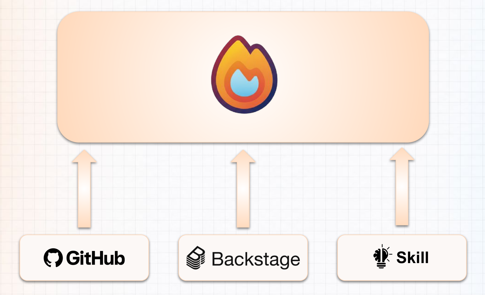

+++
title = 'firestartr'
[sidebar]
hide = true
+++

Firestartr is an open source framework to build internal developer platforms tailored
to your needs. It gives an organization one explicit map of its software — and of the
people responsible for it — and then acts on that map to create and maintain the
repositories, pipelines, and infrastructure the software needs.

## When software outgrows the organization

It usually starts small: a few repositories, and everyone knows who owns what. As teams
and products multiply, that shared understanding disappears.

- Every repository grows its own CI/CD setup, with little convention across them.
- The architecture becomes opaque: nothing describes how the pieces relate.
- Permissions accumulate person by person, so responsibility turns diffuse.

The software still runs, but the organization no longer has a model of it. Firestartr
makes that model explicit before automating anything on top of it.

## A map the business can recognize

Firestartr organizes software in layers that match how the business actually works.

### Domains

A **domain** groups the systems that serve one part of the business. In an online store,
a `commerce` domain covers the buying experience end to end.

### Systems

A **system** is an explicit grouping inside a domain, with its own responsibility. The
commerce domain splits into an `inventory-system` (catalog, search, and stock) and a
`checkout-system` (cart, orders, and payments). The boundary is deliberate: each system
owns a coherent slice of the product.

### Components

A **component** is a unit of software together with its repository. The system it
belongs to gives it a place on the map, so nine repositories become nine known
components in two systems instead of nine loose ends.

## Teams and ownership

Responsibility is part of the map. People are grouped into **teams**, and each team owns
the components of a system: an inventory team owns the inventory components, a checkout
team owns the checkout components. Ownership is exactly that — who answers for a
component, its changes, and its operation.

## Features: the stack each component needs

Components are not empty repositories. A **feature** adds the files and workflows a
repository needs, so teams adopt a capability instead of hand-rolling it. Typical
features cover Docker image builds and automated releases with `release_please`.
Applying a feature is where the map becomes concrete: a component plus its features
behaves the way the organization expects.

## Supporting infrastructure

Software also depends on resources that are not code: a bucket for a frontend's static
files, a queue, a managed database. Firestartr keeps this **supporting infrastructure**
next to the component that uses it and provisions it with Terraform. The component keeps
its place, its owner, and its features, while the infrastructure remains part of the
same picture instead of drifting into an unowned set of cloud resources.

## Three control surfaces

People do not need another tool to log into. Firestartr meets them on the surfaces they
already use:

- **GitHub** — where code, reviews, and workflows live.
- **Backstage** — where the catalog of services and ownership is browsed.
- **[Skill](https://github.com/prefapp/skills/tree/main/skills/firestartr/firestartr-operation)** — the conversational surface that turns
  a request into Firestartr instructions.

All three drive the same platform, so a change made from any of them is reflected in the
same model.

## How the Skill carries instructions

The [Skill](https://github.com/prefapp/skills) does not act directly. An instruction travels a path of three stages:

1. **fs-forge** — the step that issues the instruction to Firestartr.
2. **agent** — interprets the instruction against the map and works out what must
   change.
3. **skill** — carries the change out against the mapped components, using their
   features and supporting infrastructure.

Because every stage works from the same map, the result stays consistent with the
organization's structure instead of drifting away from it.

## Where to go next

- **Deploying resources** — practical guides for the repositories Firestartr manages:
  the `.firestartr` configuration repository, the application and system-service state
  repositories, claim validation, and migration.
- **Providers** — documentation for the providers that back claims, including the
  Terraform provider.
- **Features** — the catalog of features you can apply to repositories.
