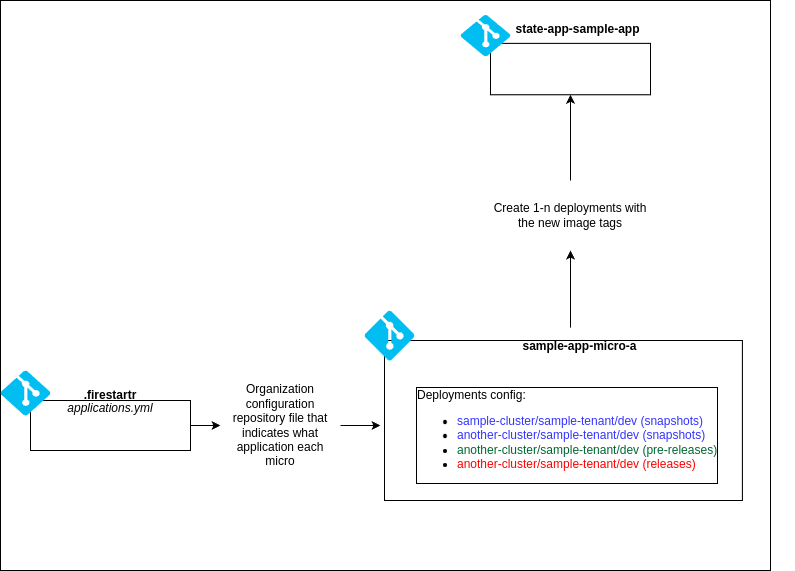
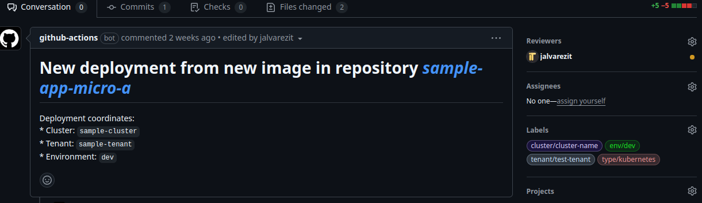

# 🔍 Overview

This documentation focuses on the structure and purpose of application repositories for deploying workloads in Kubernetes. Each application has its own dedicated repository to ensure isolation, clear organization, and streamlined management of configuration and deployment files.

The repository serves as the single source of truth for the application’s configuration across clusters, tenants, and environments.

## 📂 Repository directory structure

Applications are organized in the following directory structure within the Git repository:

### 🌱 `main` (or `master`) branch

This branch serves as the source for environment-specific configurations and high-level settings for the application.

```shell
kubernetes/
  ├── <cluster-name>/        # Target Kubernetes cluster
  │      ├── <tenant-name>/  # Team or tenant managing the app
  │      │      ├── <env-name>/    # Environment (dev, staging, prod)
  │      │      │      ├── values.yaml  # Parameters specific to the environment
  │      │      │      ├── extra_artifacts/   # Optional extra artifacts for kubernetes deployments

```


Each application deployment requires a configuration file at the following path `kubernetes/<cluster-name>/<tenant-name>/<env-name>.yaml` with the following structure:

```yaml
chart: <alias>/<chart-name>
registry: <registry_url>
version: <version>
releaseName: <release_name>
hooks: []
extraPatches: []
```

### 🚀 `deployment` branch

This branch contains the raw Kubernetes manifests that ArgoCD applies to clusters. These manifests are generated from the configurations in the `main` (or `master`) branch.

```shell
kubernetes/
  ├── <cluster-name>/        # Cluster where the application is deployed
  │      ├── <tenant-name>/  # Tenant or team managing the application
  │      │      ├── <env-name>/    # Environment (dev, staging, prod)
  │      │      │      ├── Deployment.<metadata.name>.yaml    # Kubernetes Deployment resource
  │      │      │      ├── Configmap.<metadata.name>.yaml     # ConfigMaps or other configs
  │      │      │      └── ...other-resources
```

## 📚 Repository Usage Design

There are two main flows in the state repository:

* Automatic image update: Whenever a new spanshot, pre-release or release is created on any of the microservices, the image is built and pushed to the state repository.
* On demand deployments: State values may be updated at any time by the user, just by updating the values files. Then, to apply the changes, the user must trigger the deployment.


Has been made this way to follow the GitOps principles, where the state of the system is stored in a Git repository as code, and the changes are applied through pull requests and merges.
Keeping the actual state of the system in a [*wet repository*](https://cloud.google.com/kubernetes-engine/enterprise/config-sync/docs/concepts/gitops-best-practices#create-wet-repo) or branch in this case.

### 🔄 Automatic image update

The automatic image update flow is triggered by the creation of a new snapshot, pre-release or release on any of the microservices.



Then it dispatches new deployments with the new microservice images to the state repository.



> Additionally the person that triggered the image update is added as reviewer together with appropiate labels to be abel to track it down more easily

Images versions are handled by
the charts, adding an annotation with the image version and microservice name for each resource affected. Whenever a deployment is triggered,
it retrieves the image version from the annotation if not specified by the new release. Therefore if a deployment uses two different microservices,
it will use the image version specified in the release for the microservice that has a new version, and the one specified in the annotation for the other microservice.

### 🖐️ On demand deployments

On demand deployments flow is triggered by the user using the manual workflow dispatch action,
being able to use [glob patterns](https://docs.oracle.com/en-us/iaas/Content/devops/using/glob-patterns.htm) to deploy multiple environments at once.

> The user must update the values files in the state repository before triggering the deployment.

Then *n* deployment pull requests are created, the user must review and merge them to apply the changes.


> If a pull request for a given environment is already open, the deployment will throw an error for that environment, making the user to close or merging the pull request before triggering the deployment again.


## 🔧 Branch and Deployment Revision

The deployment configuration is based on a specific Git branch and revision:

- **Branch:** `deployment`
- **Path:** `kubernetes/*/*/*` — The application is retrieved dynamically from a path that matches the directory structure described above.

This means that the application is linked to a specific folder within the `deployment` branch of the repository, enabling easy identification and deployment based on the cluster, tenant, and environment.

## ⚙️ Dynamic application deployment with ApplicationSet

Argo CD’s `ApplicationSet` configuration enables dynamic creation of application deployments. When new deployments are needed, they are automatically created by referencing the directory structure in the repository.

### How It Works:

- The **ApplicationSet** reads the structure of the repository and dynamically creates applications for each combination of cluster, tenant, and environment found in the paths under `kubernetes/*/*/*`.
- The **Application name** is generated based on the directory segments, following this format: `<tenant>-<my-app>-<environment>`
  

```yaml
# apps/<application-name>/argo-<application-name>.ApplicationSet.yaml
---
apiVersion: argoproj.io/v1alpha1
kind: ApplicationSet
metadata:
  name: app-<application-name>
  namespace: argocd
spec:
  generators:
  - git:
      directories:
      - path: <technology.type>/*/*/*  # technology.type -> kubernetes, vmss, etc. as defined by the cluster configuration in the .firestartr repo
      repoURL: https://github.com/<org>/<new-state-repo>.git
      revision: deployment
      values:
        <cluster1-name>: <cluster1-url>
        <cluster2-name>: <cluster2-url>
        <cluster3-name>: <cluster3-url>
        ...
  goTemplate: true
  goTemplateOptions:
  - missingkey=error
  template:
    metadata:
      name: 'app-<application-name>-{{index .path.segments 1}}-{{index .path.segments 2}}-{{index .path.segments 3}}'
      labels:
        app-name: '<application-name>'
    spec:
      destination:
        namespace: '{{index .path.segments 2}}-<application-name>-{{index .path.segments 3}}'
        server: '{{index .values (index .path.segments 1)}}'
      project: 'app-<application-name>'
      source:
        path: '{{index .path.segments 0}}/{{index .path.segments 1}}/{{index .path.segments 2}}/{{index .path.segments 3}}'
        repoURL: https://github.com/<org>/<new-state-repo>.git
        targetRevision: deployment
      syncPolicy:
        automated: null
        syncOptions:
        - CreateNamespace=true
        - ServerSideApply=true
      ignoreDifferences:
      - group: "policy"
        kind: PodDisruptionBudget
        jsonPointers:
        - /status
        - /metadata/uid
        - /metadata/generation
        - /metadata/resourceVersion
        - /metadata/creationTimestamp
```

## 🔔 Notification system with ArgoCD

ArgoCD notifications provides feedback to the user about the status of the deployments. There are three types of notifications:

<!--
- **Slack:** Sends messages to a Slack channel.
- **GitHub Pull Requet Comment:** Adds a comment to the pull request if exists.
-->
- **Github Commit Status:** Adds a status to the commit synced by the app.
- **Github Deployment:** Creates a deployment in the repository.

### 🔨 How It Works

ArgoCD notifications are configured with the following components:

* Templates: Define the content of the notification, using Go templates. They can be customized for each service (e.g., Slack, GitHub).
* Triggers: Define the conditions that trigger the notification. They can be based on the status of the application, the environment, or other factors. It also specifies what template to use by template name.
* Subscriptions: Define what triggers to use in each application. We are configuring it globally but it can be configured per application using annotations.

Check the [docs](https://argo-cd.readthedocs.io/en/stable/operator-manual/notifications/) for further reading.

### ⚙️ Setup

Create a GitHub App *fs-argocd-notifications* in the client with the following permissions:

* Deployments: Read & Write
* Commit statuses: Read & Write
* Environments: Read & Write

Then, generate a private key and store it in your cloud provider:

```bash
az keyvault secret set --name fs-argocd-notifications-pem --vault-name <VAULT_NAME> --file fs-argocd-notifications.<DATE>.private-key.pem
```

Create a Slack App, install it in the desired workspace, and generate a token.

Store the token in your cloud provider:

```bash
az keyvault secret set --name slack-token --vault-name <VAULT_NAME> --value <SLACK_TOKEN>
```

Make sure to have the following permissions:

* `chat:write`
* `chat:write.customize `

#### 📝 ArgoCD helm chart

We need to configure the chart with the following values:

```yaml
notifications:
  secret:
    # As we are using state repository, we cannot store the secret in the repository
    create: false

  argocdUrl: "<ARGOCD_URL>"

  notifiers:
    service.github: |
      appID: <GITHUB_APP_ID>
      installationID: <GITHUB_INSTALLATION_ID>
      privateKey: $github-privateKey
    service.slack: |
      token: $slack-token

  subscriptions:
    - recipients:
        - github:<GITHUB_APP_NAME> # fs-argocd-notifications
      triggers:
        - on-sync-failed
        - on-health-degraded
        - on-deployed

  templates:
    template.app-deployed: |
      github:
        repoURLPath: "{{.app.spec.source.repoURL}}"
        revisionPath: "{{.app.status.operationState.syncResult.revision}}"
        status:
          state: success
          label: "continuous-delivery/{{.app.metadata.name}}"
          targetURL: "{{.context.argocdUrl}}/applications/{{.app.metadata.name}}?operation=true"
        deployment:
          state: success
          environment: "{{ .app.spec.source.path }}"
          environmentURL: "{{index .app.status.summary.externalURLs 0}}"
          logURL: "{{.context.argocdUrl}}/applications/{{.app.metadata.name}}?operation=true"
          requiredContexts: []
          autoMerge: false
          transientEnvironment: false
      message: |
        {{if eq .serviceType "slack"}}:white_check_mark:{{end}} Application {{.app.metadata.name}} is now running new version of deployments manifests.
      slack:
        attachments: |
          [{
            "title": "{{ .app.metadata.name}}",
            "title_link":"{{.context.argocdUrl}}/applications/{{.app.metadata.name}}",
            "color": "#18be52",
            "fields": [
            {
              "title": "Sync Status",
              "value": "{{.app.status.sync.status}}",
              "short": true
            },
            {
              "title": {{- if .app.spec.source }} "Repository" {{- else if .app.spec.sources }} "Repositories" {{- end }},
              "value": {{- if .app.spec.source }} ":arrow_heading_up: {{ .app.spec.source.repoURL }}" {{- else if .app.spec.sources }} "{{- range $index, $source := .app.spec.sources }}{{ if $index }}\n{{ end }}:arrow_heading_up: {{ $source.repoURL }}{{- end }}" {{- end }},
              "short": true
            },
            {
              "title": "Revision",
              "value": "{{.app.status.sync.revision}}",
              "short": true
            }
            {{range $index, $c := .app.status.conditions}}
            ,
            {
              "title": "{{$c.type}}",
              "value": "{{$c.message}}",
              "short": true
            }
            {{end}}
            ]
          }]
        deliveryPolicy: Post
        groupingKey: ""
        notifyBroadcast: false
    template.app-sync-failed: |
      github:
        repoURLPath: "{{.app.spec.source.repoURL}}"
        revisionPath: "{{.app.status.operationState.syncResult.revision}}"
        status:
          state: failure
          label: "continuous-delivery/{{.app.metadata.name}}"
          targetURL: "{{.context.argocdUrl}}/applications/{{.app.metadata.name}}?operation=true"
        deployment:
          state: failure
          environment: "{{ .app.spec.source.path }}"
          environmentURL: "{{index .app.status.summary.externalURLs 0}}"
          logURL: "{{.context.argocdUrl}}/applications/{{.app.metadata.name}}?operation=true"
          requiredContexts: []
          autoMerge: false
          transientEnvironment: false
      message: |
        {{if eq .serviceType "slack"}}:exclamation:{{end}}  The sync operation of application {{.app.metadata.name}} has failed at {{.app.status.operationState.finishedAt}} with the following error: {{.app.status.operationState.message}}
        Sync operation details are available at: {{.context.argocdUrl}}/applications/{{.app.metadata.name}}?operation=true .
      slack:
        attachments: |
          [{
            "title": "{{ .app.metadata.name}}",
            "title_link":"{{.context.argocdUrl}}/applications/{{.app.metadata.name}}",
            "color": "#E96D76",
            "fields": [
            {
              "title": "Sync Status",
              "value": "{{.app.status.sync.status}}",
              "short": true
            },
            {
              "title": {{- if .app.spec.source }} "Repository" {{- else if .app.spec.sources }} "Repositories" {{- end }},
              "value": {{- if .app.spec.source }} ":arrow_heading_up: {{ .app.spec.source.repoURL }}" {{- else if .app.spec.sources }} "{{- range $index, $source := .app.spec.sources }}{{ if $index }}\n{{ end }}:arrow_heading_up: {{ $source.repoURL }}{{- end }}" {{- end }},
              "short": true
            }
            {{range $index, $c := .app.status.conditions}}
            ,
            {
              "title": "{{$c.type}}",
              "value": "{{$c.message}}",
              "short": true
            }
            {{end}}
            ]
          }]
        deliveryPolicy: Post
        groupingKey: ""
        notifyBroadcast: false

  triggers:
    # Make sure that the send field is the same as the template name and you subscribe the app with the trigger name (e.g. on-deployed)
    trigger.on-deployed: |
      - description: Application is synced and healthy. Triggered once per commit.
        oncePer: app.status.sync.revision
        send:
        - app-deployed
        when: app.status.operationState.phase in ['Succeeded'] and app.status.health.status == 'Healthy'
    trigger.on-health-degraded: |
      - description: Application has degraded
        send:
        - app-sync-failed
        when: app.status.health.status == 'Degraded'
    trigger.on-sync-failed: |
      - description: Application syncing has failed
        send:
        - app-sync-failed
        when: app.status.operationState != nil and app.status.operationState.phase in ['Error',
          'Failed']
```

#### 🔒 ArgoCD External Secrets

As we said before, we cannot store the private key in the repository, so we need to create an external secret with the private key. Therefore we need to create the following manifests:

*argocd-notifications-service-account.yml*

```yaml
apiVersion: v1
kind: ServiceAccount
metadata:
  name: argocd-notifications
  annotations:
    azure.workload.identity/client-id: <CLIENT_ID>
    azure.workload.identity/tenant-id: <TENANT_ID>
```

*argocd-notifications-secret-store.yml*
```yaml
apiVersion: external-secrets.io/v1beta1
kind: SecretStore
metadata:
  name: argocd-notifications
spec:
  provider:
    azurekv:
      authType: WorkloadIdentity
      vaultUrl: "<VAULT_URL>"
      serviceAccountRef:
        name: argocd-notifications
```

> In this case we are using Azure Key Vault as the secret store, check the [docs](https://external-secrets.io/main/provider/aws-secrets-manager/) for other providers.

*argocd-notifications-external-secret.yml*
```yaml
apiVersion: external-secrets.io/v1beta1
kind: ExternalSecret
metadata:
  name: argocd-notifications
spec:
  refreshInterval: 1h
  secretStoreRef:
    kind: SecretStore
    name: argocd-notifications
  target:
    name: argocd-notifications-secret
    creationPolicy: Owner
  data:
  - secretKey: github-privateKey
    remoteRef:
      key: secret/fs-argocd-notifications-pem # If you used a different name for the secret in the vault, change it here
```

## 🔒 Platform control through Argo Project 

With the defined directory structure, the ApplicationSet generates namespaces based on the paths of the GitOps repository. This allows us to add deployment control through the AppProject, specifically per application, with a list of allowed namespaces and destinations.

Therefore, if someone a new deployment of an application to the directories in the GitOps repository without going through the platform control, the ApplicationSet will attempt to create an Application with a namespace derived from the directories where the developer placed their artifacts. However, the AppProject will block the deployment since the generated namespace, or the configured cluster destination, is not among the allowed ones.

```yaml
---
# apps/<application-name>/argo-<application-name>.Project.yaml
---
apiVersion: argoproj.io/v1alpha1
kind: AppProject
metadata:
  name: app-<application-name>
  namespace: argocd
  annotations:
    # Make sure it matches the trigger name in the notifications configuration (e.g. on-deployed)
    notifications.argoproj.io/subscribe.on-health-degraded.slack: <slack-channel>
    notifications.argoproj.io/subscribe.on-sync-failed.slack: <slack-channel>
    notifications.argoproj.io/subscribe.on-deployed.github: <github-app-name>
    notifications.argoproj.io/subscribe.on-health-degraded.github: <github-app-name>
    notifications.argoproj.io/subscribe.on-sync-failed.github: <github-app-name>
spec:
  description: <application-name> State Project  # Obviously any description is valid
  clusterResourceWhitelist: # Add cluster wide resources that the application can manage
  # For instance we may need to create an IngressClass
  - group: networking.k8s.io
    kind: IngressClass
  sourceRepos:
  - "https://github.com/<org>/<new-state-repo>.git"
  destinations:
  - namespace: <tenant1-env1-application-namespace>
    server: <tenant1-env1-cluster-url>
  - namespace: <tenant2-env1-application-namespace>  # Add only the namespaces and clusters that you plan to configure and deploy
    server: <tenant2-env1-cluster-url>
  # - namespace: "<tenant1-env2-application-namespace>"  # <- You can add not yet configured namespaces and clusters as comments, and uncomment them with necessary
  #   server: <tenant1-env2-cluster-url>
```
