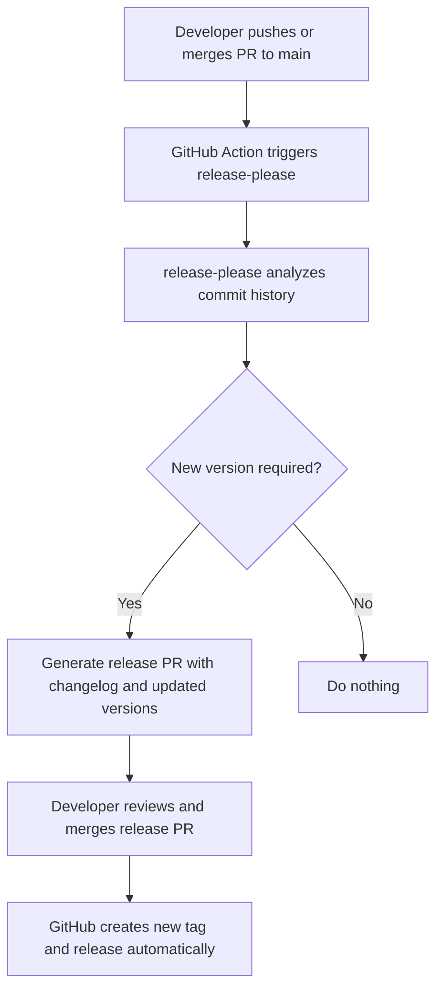

# release-please
  
## Overview

This repository is managed with [**release-please**](https://github.com/googleapis/release-please), a tool that automates the creation of release PRs and GitHub tags based on [Conventional Commits](https://www.conventionalcommits.org/en/v1.0.0/).

The purpose of this document is to describe how to:
1. Tag and release the repo using conventional commits.
2. Understand how `release-please` works under the hood.
3. Configure the repository for automated releases.

---

## 🏷️ Tagging and Releasing Terraform Modules

`release-please` automatically creates releases based on **conventional commit messages**.

### Semantic Versioning

Each release follows **semantic versioning**:  
`MAJOR.MINOR.PATCH`

| Level | Description | Example of change |
|--------|--------------|------------------|
| **MAJOR** | Breaking change | Modify resources or outputs in an incompatible way |
| **MINOR** | New features (non-breaking) | Add new variables or optional functionality |
| **PATCH** | Bug fixes / small improvements | Fix naming, typos, or small logic issues |

---

### ✅ Example Commit Messages

| Commit Type | Example Commit | Effect |
|--------------|----------------|--------|
| **fix** | `fix: correct bucket tag format` | Increments **PATCH** version |
| **feat** | `feat: add bucket versioning support` | Increments **MINOR** version |
| **feat!** | `feat!: enable mandatory encryption (breaking change)` | Increments **MAJOR** version |
| **chore** | `chore: update root module version` | No version bump (metadata only) |
| **docs** | `docs: update README with usage examples` | No version bump |
| **ci** | `ci: update GitHub Actions workflow for terraform validation` | No version bump |

---

## ⚙️ How It Works

The following diagram shows how `release-please` integrates with GitHub Actions:



### Detailed Flow

1. When a commit is pushed or a PR is merged into `main` (typically via **squash merge**), a GitHub Action runs.
2. The action executes `release-please`, which scans commit messages since the last release.
3. If commits with `feat`, `fix`, or breaking changes (`!`) are found, it determines the appropriate version bump (patch, minor, or major).
4. A **release PR** is automatically created or updated, containing:
   - Updated changelog.
   - Updated version numbers in module files.
5. When the release PR is merged, GitHub automatically:
   - Creates a tag (e.g., `aws-s3-v1.2.3`)
   - Publishes a release entry.

---

## 🧩 Configuration

The behavior of `release-please` is controlled via the `release-please-config.json` and `.release-please-manifest.json` files,
which define module paths, release types, and version tracking.

In the file `release-please-config.json`, we define how `release-please` should behave.  
It can be configured for **single repositories** or **monorepos**, and supports different release types (e.g., `terraform-module`, `node`, `python`, etc.).  
For more details, see the [manifest releaser documentation](https://github.com/googleapis/release-please/blob/main/docs/manifest-releaser.md).

By default, a simple configuration for a repository **without monorepo** structure looks like this:

```json
{
  "packages": {
    ".": {}
  }
}
```

The file `.release-please-manifest.json` keeps track of the **current released versions** of each package or module, for example:

```json
{
  ".": "1.2.3"
}
```

---

## 🧠 Notes

- Use clear, descriptive commit messages that follow the **Conventional Commits** format.  
- Use types like `ci:` or `docs:` for changes that should **not** trigger new releases.  
- Always review the **release PR** before merging to ensure that changelogs and versions are correct.
- Tag prefixes (e.g., `aws-s3-v1.2.3`) are derived from the module name defined in the configuration file.
