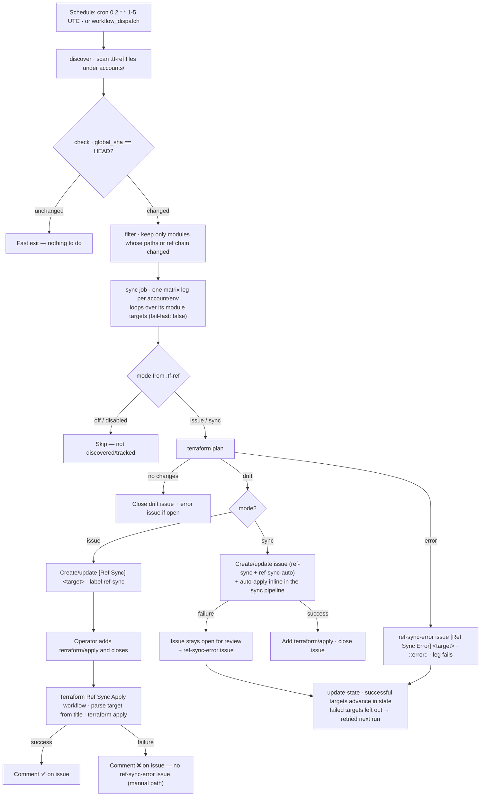

# Terraform Infra workflows

This feature contains GitHub Actions workflows and supporting scripts to automate the planning and application of Terraform infrastructure changes across multiple accounts, environments, and modules.

## Overview

The automation is designed to:
- Validate changes to Terraform modules on pull requests.
- Run `terraform plan` for changed modules on pull requests.
- Apply Terraform changes automatically when a pull request is merged and labeled with `terraform/apply`, or manually via workflow dispatch.
- Provide detailed feedback and logs as pull request comments.

## Repository Structure
The repository is structured to support multiple accounts and environments, with Terraform modules organized by account and environment. Here’s a simplified view of the structure:
```
.
├── accounts
│   ├── account1
│   │   └── pro
│   │       ├── 010-vpc
│   │       ├── 020-eks
│   │       ├── 030-iam
│   │       └── 040-lambda
│   ├── account2
│   │   ├── dev
│   │   │   ├── 10-vpc
│   │   │   └── 20-eks
│   │   └── pre
│   └── test-account
│       └── dev
│           ├── 00-state1
│           └── 01-state2
```

## Workflow Summary

### 1. Pull Request Workflow

When a pull request is opened or updated:
- **Validation**: The workflow checks which modules are affected by the changes.
- **Plan**: For each affected module, `terraform plan` is executed and the results are posted as a comment on the pull request.

When a pull request is **merged and closed** with the `terraform/apply` label:
- **Apply**: The workflow runs `terraform apply` for the affected modules and posts the results as a comment.

### 2. Manual Trigger (Workflow Dispatch)

You can manually trigger the workflow from the GitHub Actions UI:
- **Plan or Apply**: By setting the `run_plan` or `run_apply` input to `true`, you can run `terraform plan` or `terraform apply` for specified modules.

### 3. Ref-Sync (Cron Workflow)

A periodic (cron) workflow that detects when a ref-source has changed since the last time its ref-targets were applied, and triggers the configured action for each out-of-sync target.

The workflow is controlled by these feature arguments:

| Argument | Description | Default |
|---|---|---|
| `ref_sync_enabled` | Enables or disables the ref-sync workflow job. | `true` |
| `terraform_sync_cron` | Cron expression used by the scheduled ref-sync workflow. | `0 2 * * 1-5` |

#### Team notifications

The ref-sync workflow can mention a GitHub team in drift and error issues. Configure the optional global GitHub Actions variable below:

| Variable | Location | Example value |
|---|---|---|
| `REF_SYNC_NOTIFY_TEAM` | **Settings > Secrets and variables > Actions > Variables**, at repository or organization level | `@prefapp/platform` |

The value must be a valid GitHub team mention, such as `@organization/team`. If the variable is not defined or is empty, issues are created without a team mention.

#### End-to-end flow



#### Pipeline steps

- **discover** — scans all `.tf-ref` files under `accounts/` (at module, environment, or account level) and builds the job matrix.
- **check** — fast skip. Compares `global_sha` (the repo HEAD recorded in `.github/ref-sync-state.yaml` at the last run) against current HEAD; if unchanged, the run exits immediately.
- **filter** — if HEAD changed, diffs the `accounts/` folder between the recorded SHA and HEAD and keeps only modules whose source module, effective ref-chain module, local directory, shared account/environment input, or ref manifest changed. New `.tf-ref` paths are included even when they are not yet present in the state file. A change to one source module therefore does not plan its unchanged siblings.
- **sync** — one matrix leg per account/environment (with `fail-fast: false`), looping over the modules of that account/env. For each module target it reads the mode from its `.tf-ref`, runs `terraform plan`, and acts on the result.
- **update-state** — after the run, the state records failed modules as `pending_targets`. Pending modules force a retry on the next run, while successful sibling modules can advance normally.

**Sync modes (per target, read from the defining `.tf-ref` file):**
- `issue` (default) — open or update a GitHub issue mentioning maintainers; never apply automatically.
- `sync` — run `terraform plan` + `terraform apply` automatically. The apply runs inline in the sync pipeline itself (not via the apply workflow); an issue labeled `ref-sync-auto` is created and closed with the `terraform/apply` label once apply succeeds. If apply fails, the issue stays open for manual review.
- `disabled` — skip during sync. Not tracked in state (treated like `off`).
- `off` — completely ignored. Not discovered, not planned, not tracked in state.

**Labels:**

| Label | Meaning |
|---|---|
| `ref-sync` | Drift issue `[Ref Sync] <target>` — opened when drift is detected, closed when drift is resolved. |
| `ref-sync-auto` | Added to `sync`-mode drift issues. Marks issues that are auto-applied so the apply workflow ignores them (avoids a duplicate apply). |
| `ref-sync-error` | Error issue `[Ref Sync Error] <target>` — created when the sync pipeline fails for a target (plan error or failed `sync`-mode auto-apply). |
| `terraform/apply` | Operator signal: closing a `ref-sync` issue with this label triggers the apply workflow. Also added by `sync` mode when the inline auto-apply succeeds. |

**On sync failure:**
- **Plan error or `sync`-mode auto-apply failure** — the workflow creates or updates a GitHub issue titled `[Ref Sync Error] <target>` with the label `ref-sync-error`, containing the failed terraform output and signalling that the sync needs review. The issue is closed automatically once a later sync of the same target succeeds. The failing module emits a red `::error::` annotation in the logs and the sync job fails, so the failing points are marked red in the pipeline. The matrix runs with `fail-fast: false`, so a failing leg never cancels the other legs.
- **Manual apply failure (`issue` mode)** — the apply workflow posts a `❌ Terraform Apply failed` comment on the issue. No `ref-sync-error` issue is created: this path is human-driven and the failure is reported in place.
- The ref-sync state is updated per-target after each run: targets that synced successfully advance their state, while failing targets are left out of the updated state, so they are retried on the next scheduled run.

**Example `.tf-ref` with mode:**
```yaml
# accounts/account1/pre/020-rds/.tf-ref
source: prefapp-testing
mode: sync  # issue (default), sync, disabled, off
```

## Key Workflow Conditions

- **Terraform Apply** runs when:
  - The workflow is manually triggered with `run_apply: true`, **or**
  - A pull request is merged, closed, and labeled with `terraform/apply`.

- **Terraform Plan** runs when:
  - The workflow is manually triggered with `run_plan: true`, **or**
  - A pull request is open or updated (not closed).

## Skipping runs by commit type

Pull requests that only contain "noise" commits (such as documentation or CI
tweaks) can be prevented from triggering a Terraform plan/apply.

The behaviour is controlled by the `skip_commit_types` feature argument
(rendered into the workflow as `SKIP_COMMIT_TYPES`). It is configurable
per-repository: each repository that consumes this feature can override
`skip_commit_types` in its feature args, and when it is not set the default is
used.

- **Default:** `docs,ci`
- **Format:** a comma-separated list of [conventional commit](https://www.conventionalcommits.org/) type prefixes. You can add more, e.g. `docs,ci,build,test,chore`.
- **Value rules:**
  - Use the bare type only (for example `docs`, not `docs:`); the trailing `:` and any `(scope)` / `!` are handled automatically by the matcher.
  - The value is sanitized before use: entries are lowercased, surrounding whitespace is trimmed, and empty entries are ignored. So `docs,ci`, `docs, ci`, and ` Docs , CI ,, ` are all equivalent, and commit types are matched case-insensitively (`Docs: ...` matches `docs`).
  - An empty (or whitespace-only) value disables skipping entirely (every run proceeds).

A commit is considered *skippable* when its subject matches one of the
configured types, using the pattern `^(type)(\(scope\))?(!)?:`. For example,
with the default `docs,ci` the following subjects are skippable:

- `docs: update readme`
- `ci(deps): bump action`
- `docs!: drop legacy guide`

The run is skipped **only when every non-merge commit** in the pull request is skippable (merge commits are ignored). If there are no non-merge commits, the workflow fails safe to running. The moment a single commit does not match (for example `feat:`, `fix:`, `chore:`), the plan/apply proceeds as normal. This applies both to the plan on open/synchronize/reopen and to the apply on merge.

> [!NOTE]
>
> Manual runs (`workflow_dispatch`) are never affected by `skip_commit_types`.

## Supporting Scripts

### `.github/scripts/validate_tenant_changes.sh`

- Determines which account modules are affected by a pull request and builds the job matrix consumed by the plan/apply job.
- Detects changed modules by **directory**, not by file type: a change to *any* file inside a module directory (for example an external AWS policy `.json`, a `.tf`, a `.tfvars`, or an `init-from-module` file) marks that module as changed. `providers.tf` is still ignored.
- Skips the run entirely when every commit in the pull request matches one of the configured skip commit types (see [Skipping runs by commit type](#skipping-runs-by-commit-type)).

### `.github/scripts/functions.sh`

- Contains helper functions for running Terraform commands and posting results as PR comments.
- `run_terrafire_command`: Executes a Terraform command for a specific module, captures output, cleans logs, and posts results to the pull request if running in GitHub Actions.
- `populate_github_vars_file`: Loads and exports variables from a file in GitHub Actions format, supporting both simple and multi-line values.

### `.github/scripts/run_terrafire.sh`

- Invoked by the workflow to run `terraform plan` or `terraform apply` for the specified modules, using the logic defined in `functions.sh`.

### `.github/scripts/sync_ref_targets.sh`

- Periodic sync script that runs `terraform plan` on each ref-target and creates/updates/closes GitHub issues based on plan results.
- When a plan or a `sync`-mode auto-apply fails, it emits a `::error::` annotation, creates/updates a `ref-sync-error` issue (`[Ref Sync Error] <target>`), and exits non-zero so the sync job is marked red.
- See [Ref Sync](#3-ref-sync-cron-workflow) above.

### `.github/scripts/discover_ref_targets.sh`

- Scans all `.tf-ref` files under `accounts/` and builds a job matrix grouped by account and environment.
- Supports module-level, environment-level, and account-level ref manifests with skip_modules and chaining.

### `.github/scripts/check_ref_sync_state.sh`

- Manages the ref-sync state file (`.github/ref-sync-state.yaml`) that tracks `global_sha` and per-target source SHAs.
- Fast-exits when HEAD is unchanged; runs `git diff` filtered to `accounts/` when HEAD changed.

### `.github/scripts/ref_sync_local.sh`

- Runs the same `discover -> check -> filter -> sync` pipeline locally using the current AWS profile.
- For targets with `.tf-ref` `mode: sync`, applies automatically with `-auto-approve` after the plan detects drift. For other applicable modes, displays the plan and asks the operator for `y` before applying without `-auto-approve`.
- A confirmation other than `y`/`yes`, or an unavailable interactive terminal, leaves the target pending and exits with an error so it can be reviewed and retried.
- Before each target, it can import the `TF_VAR_*` environment *variables* defined in the target's GitHub environment (`<tenant>/<env>`), mirroring what the workflows export in CI. The script asks `[y/N]` (default: no) before running; set `REF_SYNC_LOCAL_FETCH_TF_VARS=true|false` to skip or force the prompt.
- Imported values override same-named `TF_VAR_*` variables exported in your shell, and each target runs only with its own environment's variables plus your original shell values — a variable defined in one environment never reaches another target's run. Requires `gh` authenticated with permission to read repository environment *variables* (environment secrets are never imported).
- By default, the script updates `.github/ref-sync-state.yaml`; use `--no-state` to run without modifying the state file. It does not commit or push changes.
- Local runs do not create or update GitHub issues. The required AWS/backend variables and `FIRESTARTR_TENANTS_FOLDER` still apply.

Run it from the repository root:

```bash
export FIRESTARTR_BACKEND_PROFILE=default
./.github/scripts/ref_sync_local.sh
```

To avoid updating the state file:

```bash
./.github/scripts/ref_sync_local.sh --no-state
```

To import the GitHub environments' `TF_VAR_*` variables without being asked:

```bash
REF_SYNC_LOCAL_FETCH_TF_VARS=true ./.github/scripts/ref_sync_local.sh
```

## Ref-source: Sharing Terraform code across accounts

The ref-source feature lets one module or account (the **ref-source**) act as the canonical source of Terraform code for one or more **ref-targets**. Instead of duplicating `.tf` files, the target directory contains only a `.tf-ref` manifest file and optionally `.tfvars` overrides. At runtime, `terrafire.sh` reads the manifest and materialises the code from the source.

Each target keeps its own independent `terraform.tfstate`.

### Module-level ref

Place a `.tf-ref` file inside the target module directory:

~~~yaml
# accounts/account1/pre/020-rds/.tf-ref
source: account1/dev/020-rds
~~~

When running on `account1/pre/020-rds`, Terraform code is resolved from `account1/dev/020-rds` and `terraform.tfvars` in `account1/pre/020-rds/` overrides variable values.
### Account-level ref

Place a `.tf-ref` in the account root to apply it to all modules under that account:

~~~yaml
# accounts/account1/.tf-ref
source: account2
skip_modules:
  - 040-lambda
~~~

Each module under `account1/` resolves to the parallel path under `account2/` (e.g. `account1/pre/020-rds` → `account2/pre/020-rds`). Modules listed in `skip_modules` are excluded and use their own code.
### Chaining refs (DR)

A ref-target can point to another ref-target, enabling DR scenarios. The resolution follows the chain until it reaches a directory with actual `.tf` code:

```yaml
# accounts/account1/pro/.tf-ref  →  points to account1/pre
source: account1/pre

# accounts/account1/pre/.tf-ref  →  points to account1/dev
source: account1/dev

# accounts/account1/dev/rds/  →  actual Terraform code
```

`source` is a path under `accounts/` — `account/env` points to an environment, `account` to an account, `account/env/module` to a module. When running on `account1/pro/rds`, the chain resolves as `pro → pre → dev`, and code is materialised from `account1/dev/rds`. Each target along the chain can override variables with its own `.tfvars`.

> Resolution is limited to 10 hops to prevent circular references.

### Override rules

- Source `.tf` code is used as-is for execution
- Target `.tfvars` override variable values at runtime
- Variable definitions (`variable` blocks) come from the source
- Each target has its own `terraform.tfstate` (independent from the source)

### `.auto.tfvars` files

Files matching `*.auto.tfvars` are automatically loaded by Terraform. How they are collected depends on whether the module is a **ref-target** (has a `.tf-ref`) or a **standalone** module.

#### Ref-target: layered collection (with rank prefixes)

When a module has a `.tf-ref`, `*.auto.tfvars` files are collected from **every directory along the ref chain** — the target's own module/env/account directories plus the same hierarchy of each source hop down to the terminal source. Each file is copied into the execution workdir with a numeric rank prefix (`NNN_<name>.auto.tfvars`): higher rank sorts later in Terraform's lexicographic auto-load order, so it wins.

Chain order is the primary precedence axis — the ref-target (first `.tf-ref`) outranks every downstream hop, and the terminal source ranks last. Within each hop, the existing directory hierarchy is kept (module > env > account). Shared directories (the same account across hops, root) are deduplicated and keep their highest rank.

For a chained ref `pre → dev` on module `rds` (while `pro` remains a standalone module, shown below), the collected files and their ranks are:

```
accounts/
├── root.auto.tfvars                  ──────────────────────────────►  000_root.auto.tfvars   (root, lowest)
└── account1/
    ├── shared.auto.tfvars            ──────────────────────────────►  003_shared.auto.tfvars (account, highest rank kept)
    ├── pro/                          (standalone — no .tf-ref, see below; not part of this chain)
    ├── pre/                          (ref-target, first .tf-ref)
    │   ├── .tf-ref → dev
    │   ├── pre.auto.tfvars           ──────────────────────────────►  004_pre.auto.tfvars    (env)
    │   └── rds/
    │       └── vars.auto.tfvars      ──────────────────────────────►  005_vars.auto.tfvars  (module, highest)
    └── dev/                          (terminal source, no further ref)
        ├── dev.auto.tfvars           ──────────────────────────────►  001_dev.auto.tfvars   (env, lowest)
        └── rds/
            └── vars.auto.tfvars      ──────────────────────────────►  002_vars.auto.tfvars  (module, lowest)
```

Lexicographic load order (later = wins): `000_root < 001_dev < 002_vars(dev) < 003_shared < 004_pre < 005_vars(pre)`. The ref-target's `pre` values win; the terminal source's `dev` values rank last; the shared `account1` directory appears only once, at its highest rank.

#### Standalone module (no `.tf-ref`): plain copy

A standalone module has no source, so nothing can collide with its own files. Only its **own directory hierarchy** contributes — the plain copy loop collects `*.auto.tfvars` from root, account, environment, and module directories, copied **without** rank prefixes, ordered from least specific to most specific so later copies win:

```
accounts/
├── root.auto.tfvars                  ──────────────────────────────►  workdir/root.auto.tfvars   (copied first)
└── account1/
    ├── shared.auto.tfvars            ──────────────────────────────►  workdir/shared.auto.tfvars (copied 2nd)
    ├── pro/                          (standalone — no .tf-ref)
    │   ├── pro.auto.tfvars           ──────────────────────────────►  workdir/pro.auto.tfvars    (copied 3rd)
    │   └── rds/
    │       └── vars.auto.tfvars      ──────────────────────────────►  workdir/vars.auto.tfvars   (copied last, wins)
```

A standalone module **never** pulls `*.auto.tfvars` from another account — cross-account variable sharing only happens through a ref chain.

#### Summary

| | Ref-target (has `.tf-ref`) | Standalone (no `.tf-ref`) |
|---|---|---|
| Directories that contribute | Every hop of the ref chain (target + sources): module, env, account of each, plus root | Only its own: module, env, account, root |
| Filename in workdir | Rank-prefixed `NNN_<name>.auto.tfvars` | Plain `name.auto.tfvars` |
| Precedence | Chain order first, then module > env > account > root | Copy order: root < account < env < module (later wins) |
| Shared dirs (same account across hops, root) | Deduplicated, highest rank kept | N/A |
| Other account's files | Pulled only via the ref chain | Never |

### Reference

| Term | Description |
|---|---|
| **Ref-source** | Module or account whose Terraform code is used as the canonical source |
| **Ref-target** | Directory with a `.tf-ref` manifest and optional `.tfvars` overrides |
| **Ref manifest** | YAML file (`.tf-ref`) declaring the source path and optional skip list |
| **Ref resolution** | Runtime process that reads `.tf-ref` and materialises code from the source |
| **Ref sync workflow** | Workflow that scans `.tf-ref` files, runs plan, and creates/updates/closes issues on drift |
| **Ref sync apply workflow** | Workflow triggered when a ref-sync issue is closed with `terraform/apply` label |
| **Ref-sync error issue** | `[Ref Sync Error] <target>` issue (label `ref-sync-error`) created when the sync pipeline fails for a target |
| **Sync mode** | Field in `.tf-ref` controlling drift response: `issue`, `sync`, `disabled`, or `off` |
| **Ref-sync state** | YAML file (`.github/ref-sync-state.yaml`) tracking global SHA and per-target state |

## Environment variables

### Required variables for GitHub Actions Workflows and Manual Execution

The scripts rely on several environment variables for Terraform backend configuration. These variables:
- should be defined in your GitHub repository settings as environment variables.
- Or be defined as shell environment variables in case of manual execution.

> [!TIP]
>
> Each GitHub Actions environment (e.g., `account1/staging`, `account2/production`) can define its own set of variables.

| Variable                    | Description                                                  | Example value                                 |
| --------------------------- | ------------------------------------------------------------ | --------------------------------------------- |
| FIRESTARTR_BACKEND          | Name of the S3 bucket where the Terraform backend will reside | `example-tfstate-storage`                     |
| FIRESTARTR_BACKEND_REGION   | AWS region where the Terraform backend will be stored        | `us-east-1`                                   |
| FIRESTARTR_BACKEND_ROLE_ARN | IAM Role ARN for accessing backend resources                 | `arn:aws:iam::123456789012:role/example-role` |
| FIRESTARTR_LOCK             | DynamoDB table name for state lock                           | `example-tf-lock`                             |

### TF_VAR_* variables from GitHub Environments

Any variable defined in a GitHub Actions environment *variable* (i.e., from the `vars` context) whose name starts with `TF_VAR_` is automatically exported as an environment variable before running Terraform (environment **secrets** are not exported this way).

Terraform automatically loads these `TF_VAR_*` environment variables, so they are available as input variables without extra wiring.

To reduce confusion and improve troubleshooting, the workflow also appends a "TF_VAR variables passed to Terraform" table to the GitHub Actions job summary when these variables exist (values may be masked when the variable name looks sensitive; avoid putting secrets in `vars`):
- Variable name
- Value (masked when the name looks sensitive)
- Target environment

The same import is available locally through `ref_sync_local.sh` (see its section above): with your confirmation, each target runs with the `TF_VAR_*` variables of its own GitHub environment `<tenant>/<env>`, overriding same-named values exported in your shell.

### Additional variables for Manual Execution

For manual use of `terrafire.sh`, you also **need the following environment variables** (in addition to the shared backend variables documented above):

| Variable                    | Description                                                                                                 | Example value                          |
| --------------------------- | ----------------------------------------------------------------------------------------------------------- | -------------------------------------- |
| FIRESTARTR_BACKEND_PROFILE  | AWS profile used for local/manual backend access. Required for non-CI execution.                           | `default`                              |
| FIRESTARTR_TENANTS_FOLDER   | Full path to the folder where account configuration directories reside. If unset, it defaults to `pwd`.     | `/home/path/to/your/project/accounts/` |

### Initializing the Terraform backend

The script `bootstrap/prepare.sh` initializes and configures the Terraform backend for its use. It generates the S3 bucket, the DynamoDB table for the Terraform backend, and the IAM role for accessing these resources. When it completes its execution, it will output all the values for these variables.

> [!CAUTION]
>
> This script generates a new Terraform backend each time it is executed, so it must be **executed only once** to avoid **overwriting existing state**.


## Usage in GitHub Actions

### Automatic

- Open a pull request to trigger validation and planning.
- Merge a pull request with the `terraform/apply` label to trigger an apply.

### Manual

- Go to the Actions tab in GitHub.
- Select the workflow and click "Run workflow".
- Set the desired inputs (`run_plan` or `run_apply`, account, modules, etc.).

## Notes & Troubleshooting

- **Labels and PR Merges**: The workflow checks for the `terraform/apply` label at the time the pull request is closed and merged. If the label is added too late (right before merging), GitHub's event payload may not include it, and the apply step may not trigger. To ensure reliable automation, add the label before merging.
- **Logs and Feedback**: All Terraform output is posted as a PR comment and grouped in the Actions logs for easy review.

---

For more details, see the workflow file at `.github/workflows/terraform-plan-apply.yaml` and the scripts in `.github/scripts/`.

